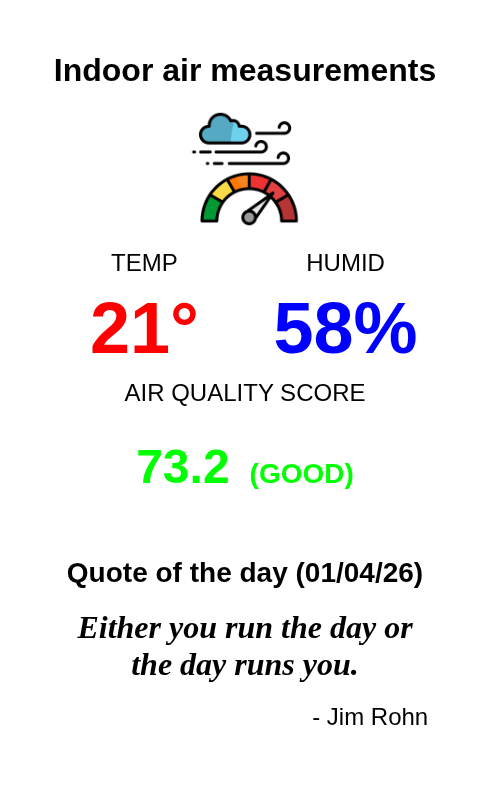

# Sensor & Quote Plugin for InkyPi

This plugin for InkyPi displays sensor data and an inspirational Zen quote. It's designed to be flexible, allowing you to source sensor data from either a remote device using SSH or a local file.

## Features

This plugin is an extension for the [InkyPI](https://github.com/fatihak/InkyPi) e-paper display frame and includes the following features:

*   **Sensor Data Display:** Shows readings from a temperature and humidity sensor, such as a BME680.
*   **Inspirational Quote:** Displays a random Zen quote alongside the sensor data.
*   **Flexible Data Sourcing:** You can choose how to get your sensor data:
    *   **Remote (SSH):** Fetch sensor data from a device on your network.
    *   **Local (File):** Read sensor data directly from a local file.

## JSON Data Format

The plugin expects a JSON file with the following structure. 

```json
{
    "temperature": "22.0°C",
    "humidity": "56.8%",
    "pressure": "1000.6 hPa",
    "gas_resistance": "186806 Ohm",
    "gas_label": "GOOD",
    "gas_label_class": "gas-buono",
    "air_quality_score": "74.1",
    "air_quality_label": "GOOD",
    "altitude": "105.68 meters"
}
```

## Example on e-ink display


